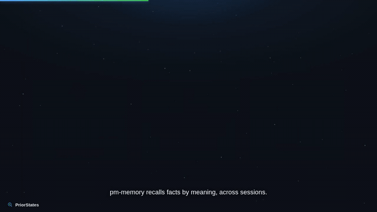
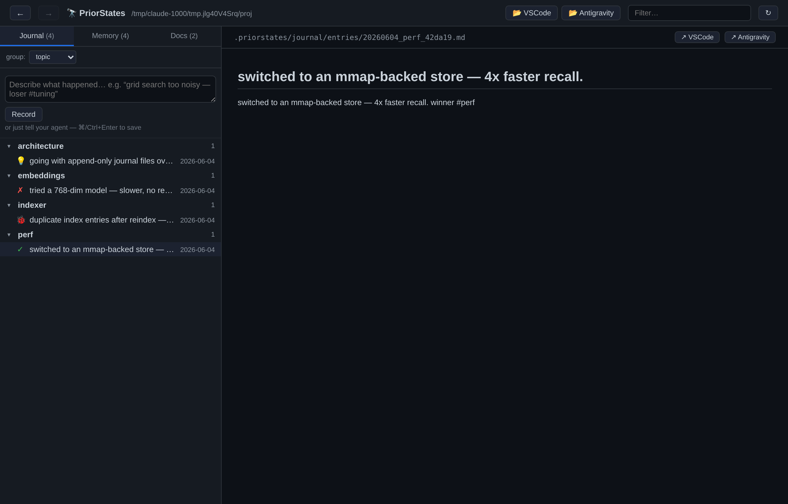
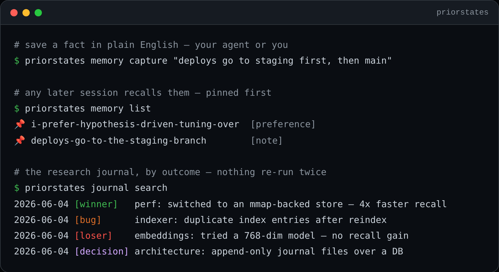

<div align="center">

# 🔭 PriorStates

### Shared memory &amp; a research journal for your AI agents

[](LICENSE)
[](https://www.python.org/)
[](https://modelcontextprotocol.io/)
[](#private-by-default)
[](https://github.com/zqin2012/priorstates)

**Coding agents are amnesiacs** — every session starts cold, re-deriving what you
already taught them and re-running experiments a past session already concluded.
PriorStates gives **Claude, Codex &amp; Gemini** one **local** memory and a searchable
**research journal**, so what one session learns, the next one remembers.

Runs entirely on your machine · CPU-only · no API keys · no cloud calls.

🌐 **[priorstates.com](https://priorstates.com)**  ·  🎬 **[80-second demo](https://priorstates.com)**  ·  📖 **[Docs](docs/USER_GUIDE.md)**



</div>

## Install — in one sentence

Already using Claude, Codex, or Gemini? Hand it one line:

> **Install PriorStates: fetch https://priorstates.com/install.md and follow it.**

The agent reads [`AGENT_INSTALL.md`](AGENT_INSTALL.md), installs the package, wires
itself over MCP, and verifies with `priorstates doctor` — then restart it to load
the new tools.

**Prefer to do it yourself?**

```bash
pip install --user --no-cache-dir "priorstates @ git+https://github.com/zqin2012/priorstates.git"
priorstates init            # create ~/.priorstates + per-project .priorstates/
priorstates agents install  # wire Claude / Codex / Gemini over MCP
priorstates cockpit         # open the web cockpit → http://127.0.0.1:7700
```

Native installers (`.deb` / macOS `.pkg` / Windows) and a source install are in
**[docs/QUICKSTART.md](docs/QUICKSTART.md)**. No model download is required — a
built-in CPU hashing embedder works out of the box.

## What's inside

| | Subsystem | What it does |
|---|---|---|
| 🧠 | **memory** | A local semantic store. Save a fact once — any future session recalls it *by meaning*. Pinned facts are injected into every session. |
| 📓 | **journal** | An append-only research log. Every winner, loser, bug &amp; decision becomes a searchable entry, so no experiment is run twice. |
| 🛰️ | **cockpit** | A dependency-free local web app that maps your memory, journal &amp; docs — search, group, dashboards. Optional embedded **terminal** (`--terminal`) to run your agent CLIs right in the browser. |
| 📝 | **mdlab** | Runnable Markdown: interleave prose, code &amp; results in one file and splice output back in. |

All of it is wired into your agents over the open **[MCP](https://modelcontextprotocol.io/)**
protocol by `priorstates agents install` — so they *recall* before acting and
*record* durable conclusions back, automatically.

## MCP server

`priorstates agents install` registers the server into Claude / Codex / Gemini for
you; to run it directly over stdio: **`priorstates mcp`**. It exposes 10 tools:

- **memory** — `memory_add` · `memory_search` · `memory_get` · `memory_list_pinned` · `memory_pin` · `memory_delete`
- **journal** — `journal_add` · `journal_search` · `journal_regen`
- **mdlab** — `mdlab_run`

## See it in action

The **cockpit** maps your whole research surface; the **CLI** captures and recalls from your terminal.





## Agent-neutral

One memory store and one journal, surfaced to **Claude · Codex · Gemini · Antigravity**
through MCP and a pinned context block — no lock-in, no rewrites. Switch agents
without losing a thing.

## Private by default

Everything lives under `~/.priorstates/` and per-project `.priorstates/`. The
default embedder is **CPU-only and offline** — no API keys, no telemetry, no cloud
calls. Upgrade to semantic recall with a single optional ~127&nbsp;MB model download
whenever you want.

## Share a workspace

Export your memory + journal as a portable bundle and hand it to a teammate (or
host it anywhere — any file or URL works):

```bash
priorstates workspace export --name my-project        # → my-project.psworkspace
priorstates workspace import ./my-project.psworkspace # on the other machine (or a URL)
```

Imported memory surfaces through the same MCP tools — no extra wiring. Imports are
**checksum-verified, shown for confirmation before ingest, and tagged with their
source** (and never auto-pinned). The **cockpit** has **Export** / **Import**
buttons too (Import needs the cockpit started with `--allow-write`).

**New here?** Load a ready-made sample to see PriorStates populated instantly:

```bash
priorstates workspace import --demo
```

## Docs

- **[docs/USER_GUIDE.md](docs/USER_GUIDE.md)** — the everyday-use manual. **Start here.**
- **[docs/QUICKSTART.md](docs/QUICKSTART.md)** — install + first run.
- **[docs/RESEARCH_WORKFLOW.md](docs/RESEARCH_WORKFLOW.md)** — research folders + how agents log to the journal.
- **[docs/DATA_MODEL.md](docs/DATA_MODEL.md)** — on-disk schemas + the `.psmem` layout.
- **[packaging/README.md](packaging/README.md)** — native `.deb` / macOS / Windows packages.

## Status

**v0.1 — working end-to-end:** memory, journal, mdlab, MCP server (10 tools),
agent wiring (Claude / Codex / Gemini / Antigravity), the web cockpit, and the
desktop launcher are all built and tested. Optional semantic model downloads on
demand; the hashing fallback needs zero setup. A background embedder daemon and
an autonomous `priorstates research` runner are next.

Issues and PRs welcome.

## Get in touch

Questions, ideas, or feedback — **[service@priorstates.com](mailto:service@priorstates.com)**.
Bug reports and feature requests are welcome as GitHub issues.

## License

**Apache-2.0** (permissive + patent grant). See [LICENSE](LICENSE) and [NOTICE](NOTICE).
Copyright 2026 Zhendong Qin.
